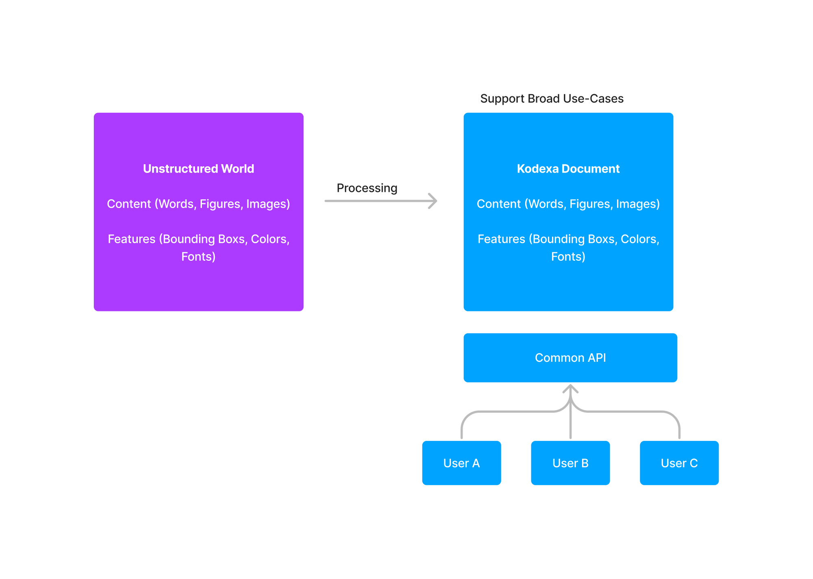
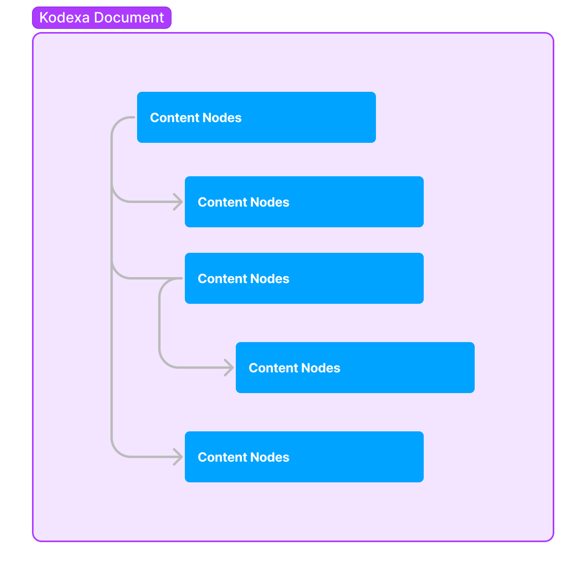
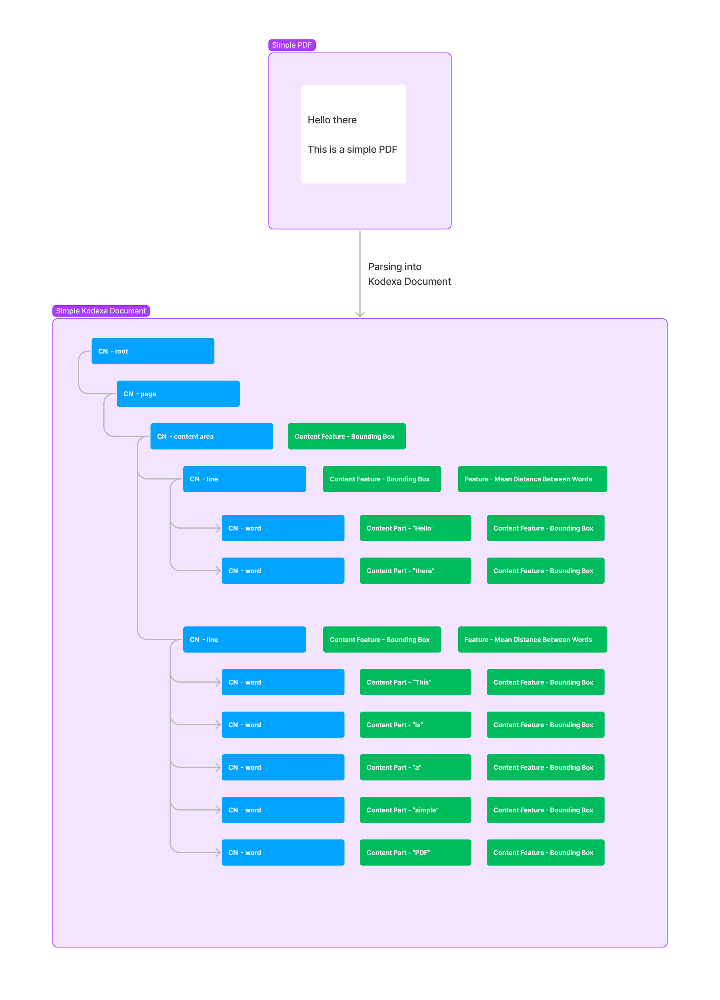
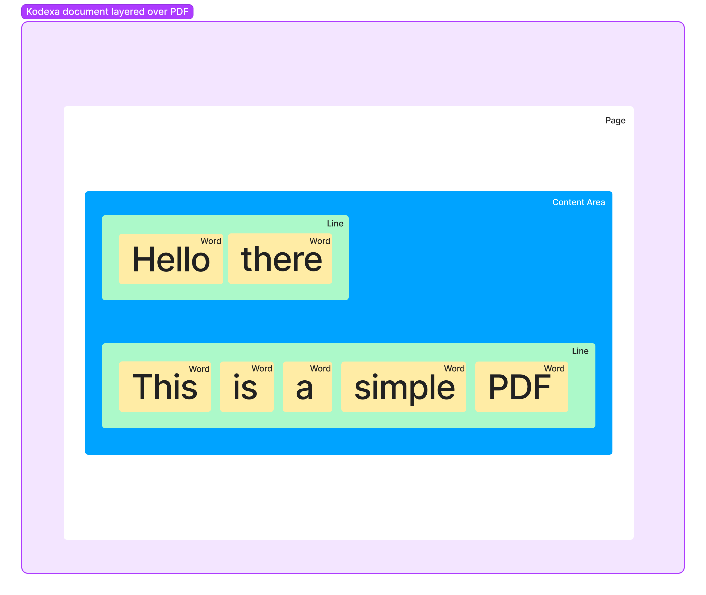

# What is a Kodexa Document

## I. Purpose

The purpose of a Kodexa document is to represent unstructured data as a **generalized structured document** that can *
*support a wide variety of use cases**. The underlying idea is that given unstructured data, how do we introduce
structure to better access its contents and **standardize how we work with documents**.

This resulting Kodexa document object can then be accessed using a common API, and users can make use of the object's
methods to extract the content they need. By storing data in this manner, we can structure content in such a way that it
is **flexible** while also **allowing for the addition of features** to describe the contents further.

## II. Structure

Now, we can start discussing the structure of a Kodexa document. A Kodexa document is a **hierarchical tree like
structure** **composed of content nodes**. These content nodes can be one of a variety of types, such as:

- **Root Nodes**
    - These nodes are used to reference the document in its entirety. All nodes in a Kodexa document can be traced back
      to its root node.
- **Page Nodes**
    - Page nodes are used to reference specific pages in a document.
- **Content Area Nodes**
    - Content area nodes are used to reference blocks of content within a specific page. These content areas can be
      blocks of text or images.
- **Line Nodes**
    - Inside a specific content area, line nodes are used to reference specific lines in a block of text.
- **Word Nodes**
    - Word nodes are the leaf nodes of our document tree. These nodes contain the actual content of our document.

Each content node consists of the following:

1. **Content Parts**:
    - Contains the actual content. This content is usually a string or an encoded image. Usually, **only the leaf nodes
      ** of the tree **contain the actual content parts** in a Kodexa document.
2. **Content Features**:
    - These content features are used to **describe or add information about a specific content node**.
    - Content features can also be described by their **type**. Some examples of these types are spatial features like
      bounding boxes and text features like font.

## III. A Simple Kodexa Document

To help you better understand and visualize what has been discussed so far, here is an example of a simple PDF and its
corresponding Kodexa document. The step-by-step process for converting the PDF into a Kodexa document is also described
below

1. To start, a root node is used to reference our simple PDF as a whole.
2. Next, we can add a page node that references our page.
3. After which, we would need a content area node to reference where the content is in our document. This content area
   node has a spatial content feature, bounding box, to help users see where this specific content area is on the page.
4. Next, we can create a line which can be used to reference each line in a content area. Since our content area has two
   lines, we’ll need to create two line nodes.
5. Lastly, we can create word nodes for each of our line nodes to reference each of the words in a line.

Our final Kodexa document tree can also be visualized by layering its data on top of our initial PDF

