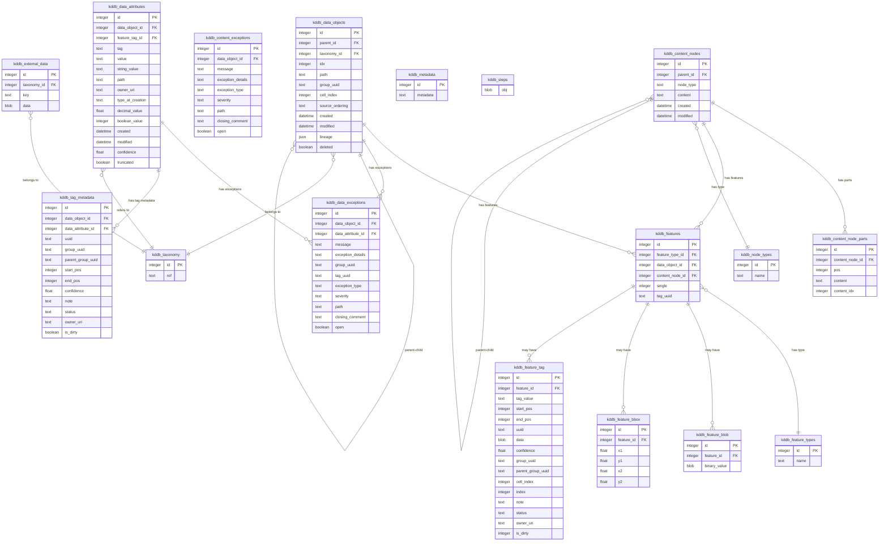

# Database Structure

```mermaid
erDiagram
    kddb_taxonomy {
        integer id PK
        text ref
    }

    kddb_data_objects {
        integer id PK
        integer parent_id FK
        integer taxonomy_id FK
        integer idx
        text path
        text group_uuid
        integer cell_index
        text source_ordering
        datetime created
        datetime modified
        json lineage
        boolean deleted
    }
    
    kddb_node_types {
        integer id PK
        text name
    }
    
    kddb_content_nodes {
        integer id PK
        integer parent_id FK
        text node_type
        text content
        datetime created
        datetime modified
    }
    
    kddb_content_node_parts {
        integer id PK
        integer content_node_id FK
        integer pos
        text content
        integer content_idx
    }
    
    kddb_content_exceptions {
        integer id PK
        integer data_object_id FK
        text message
        text exception_details
        text exception_type
        text severity
        text path
        text closing_comment
        boolean open
    }
    
    kddb_data_exceptions {
        integer id PK
        integer data_object_id FK
        integer data_attribute_id FK
        text message
        text exception_details
        text group_uuid
        text tag_uuid
        text exception_type
        text severity
        text path
        text closing_comment
        boolean open
    }
    
    kddb_feature_types {
        integer id PK
        text name
    }
    
    kddb_features {
        integer id PK
        integer feature_type_id FK
        integer data_object_id FK
        integer content_node_id FK
        integer single
        text tag_uuid
    }
    
    kddb_feature_blob {
        integer id PK
        integer feature_id FK
        blob binary_value
    }
    
    kddb_feature_bbox {
        integer id PK
        integer feature_id FK
        float x1
        float y1
        float x2
        float y2
    }
    
    kddb_feature_tag {
        integer id PK
        integer feature_id FK
        text tag_value
        integer start_pos
        integer end_pos
        text uuid
        blob data
        float confidence
        text group_uuid
        text parent_group_uuid
        integer cell_index
        integer index
        text note
        text status
        text owner_uri
        integer is_dirty
    }
    
    kddb_data_attributes {
        integer id PK
        integer data_object_id FK
        integer feature_tag_id FK
        text tag
        text value
        text string_value
        text path
        text owner_uri
        text type_at_creation

        float decimal_value
        integer boolean_value
        datetime created
        datetime modified
        float confidence

        boolean truncated
    }
    
    kddb_tag_metadata {
        integer id PK
        integer data_object_id FK
        integer data_attribute_id FK
        text uuid
        text group_uuid
        text parent_group_uuid
        integer start_pos
        integer end_pos
        float confidence
        text note
        text status
        text owner_uri
        boolean is_dirty
    }
    
    kddb_metadata {
        integer id PK
        text metadata
    }
    
    kddb_steps {
        blob obj
    }
    
    kddb_external_data {
        integer id PK
        integer taxonomy_id FK
        text key
        blob data
    }

    kddb_content_nodes ||--o{ kddb_content_node_parts : "has parts"
    kddb_content_nodes ||--o{ kddb_features : "has features"
    kddb_content_nodes }o--|| kddb_node_types : "has type"
    kddb_content_nodes ||--o{ kddb_content_nodes : "parent-child"
    kddb_data_objects ||--o{ kddb_features : "has features" 
    kddb_data_objects ||--o{ kddb_data_exceptions : "has exceptions"
    kddb_data_attributes ||--o{ kddb_data_exceptions : "has exceptions"
    kddb_data_attributes ||--o{ kddb_tag_metadata : "has tag metadata"
    kddb_data_objects ||--o{ kddb_data_objects : "parent-child"
    kddb_data_objects }o--|| kddb_taxonomy : "belongs to"
    kddb_data_attributes }o--|| kddb_taxonomy : "refers to"
    kddb_features }o--|| kddb_feature_types : "has type"
    kddb_features ||--o{ kddb_feature_blob : "may have"
    kddb_features ||--o{ kddb_feature_bbox : "may have"
    kddb_features ||--o{ kddb_feature_tag : "may have"
    kddb_external_data }o--|| kddb_taxonomy : "belongs to"
```